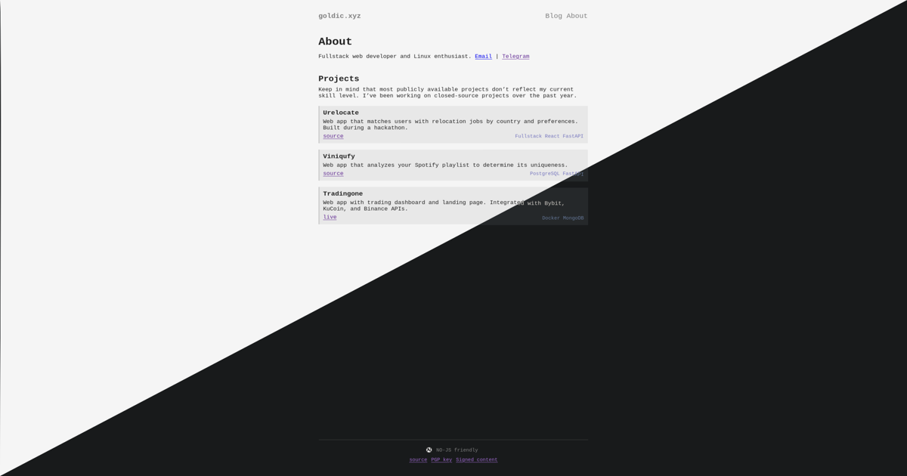

# Goldic_site



My personal lightweight website built with **StaticJinja**.  
Showcases a few projects and important links.  
Works entirely without JavaScript.

## Setup

Clone the repo

```bash
git clone git@github.com:goldic342/goldic_site.git
```

Build the docker image

```bash
docker build -t goldic_site .
```

Run

```bash
docker run -p 3001:3001 goldic_site
```
