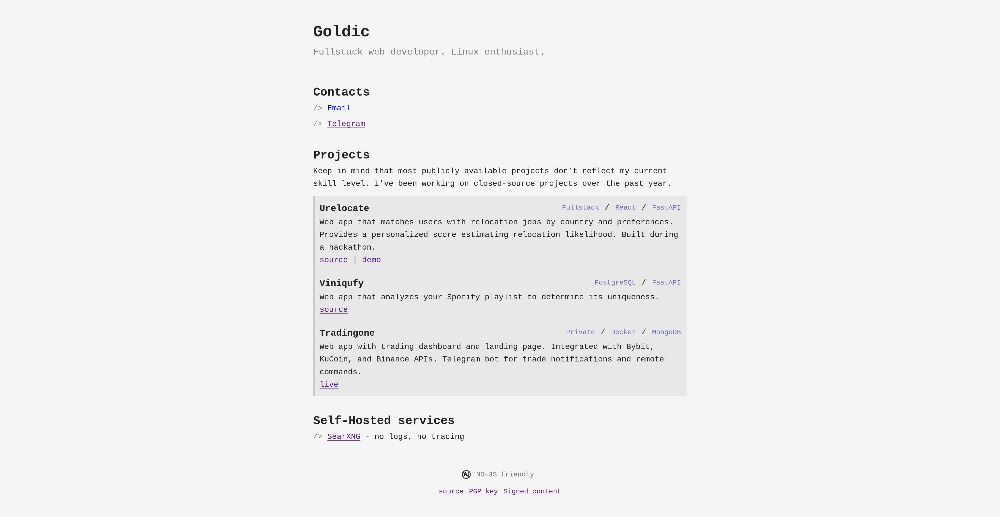

<p align="center">
  <a href="https://goldic.xyz"></a>
</p>
<p align="center">
    Personal lightweight website with markdown blog&nbsp;
  <a href="https://wakatime.com/badge/user/4b3fa1b9-e6b6-4b55-902c-c872b9c6f6cb/project/4afac1c8-0dac-4958-b2c8-f14b780174ea"></a>
</p>
<p align='center'>
</p>

## Features

- Works entirely without JavaScript.
- Markdown based blog
- SEO optimizations

## Setup

Clone the repo

```bash
git clone git@github.com:goldic342/goldic_site.git
```

Build the docker image

```bash
docker build -t goldic_site .
```

Run

```bash
docker run -p 3001:3001 goldic_site
```

### Docker compose

Uses an external Docker network by default.
For `localhost` deployment, disable networks and enable port mapping.
